# 🍽️ Sistema Web para Restaurante

[](LICENSE)
[](https://www.php.net/)
[]()

Sistema web completo para la gestión y presentación de un restaurante, desarrollado en PHP bajo una arquitectura MVC ligera y **totalmente responsive**. Permite a los usuarios visualizar el menú, registrarse, iniciar sesión, gestionar un carrito de compras y contactar al restaurante. Ideal para proyectos académicos o como base para desarrollos profesionales.

---

## 📸 Capturas de Pantalla

### 🏠 Inicio
<table>
  <tr>
    <td align="center">
      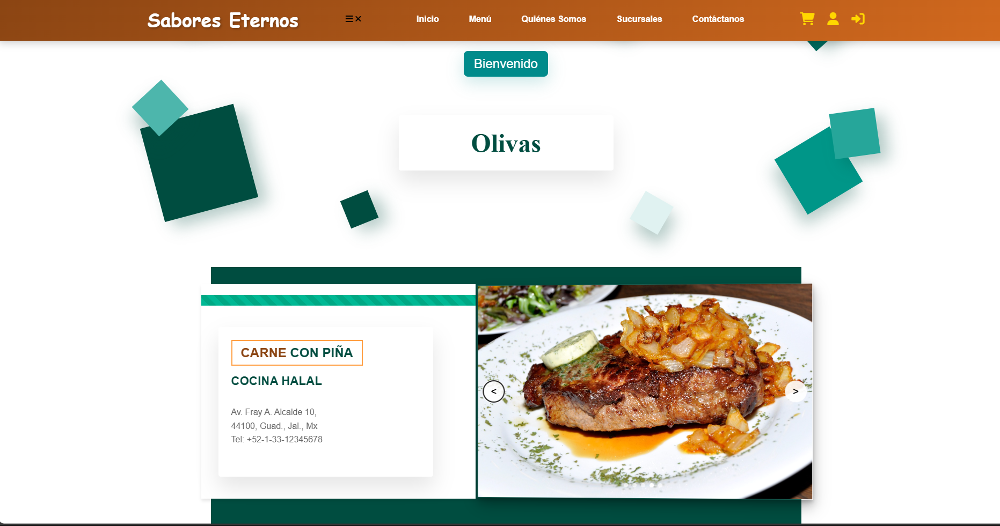<br><b>Inicio 1</b>
    </td>
    <td align="center">
      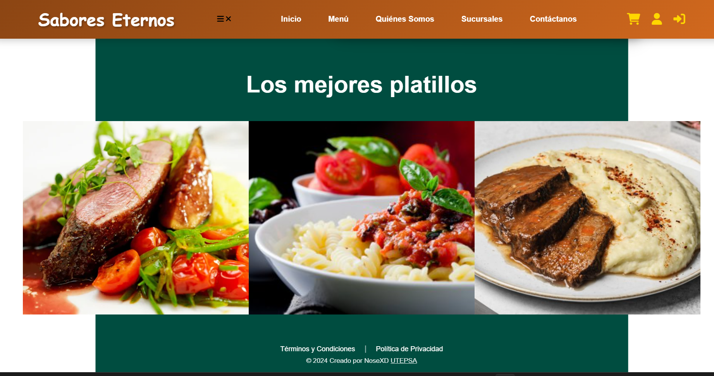<br><b>Inicio 2</b>
    </td>
  </tr>
</table>

### 🍽️ Menú y Carrito
<table>
  <tr>
    <td align="center">
      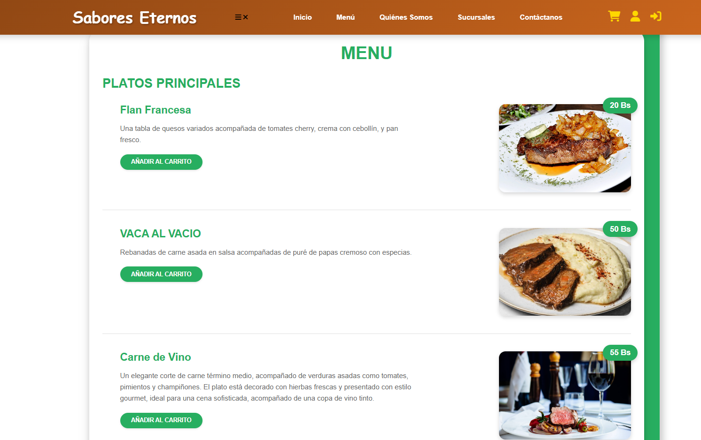<br><b>Menú</b>
    </td>
    <td align="center">
      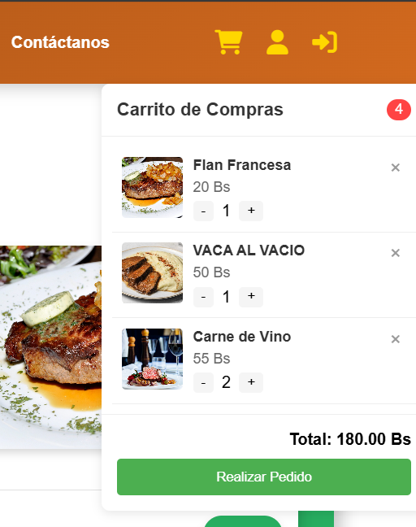<br><b>Carrito</b>
    </td>
  </tr>
</table>

### 👤 Autenticación
<table>
  <tr>
    <td align="center">
      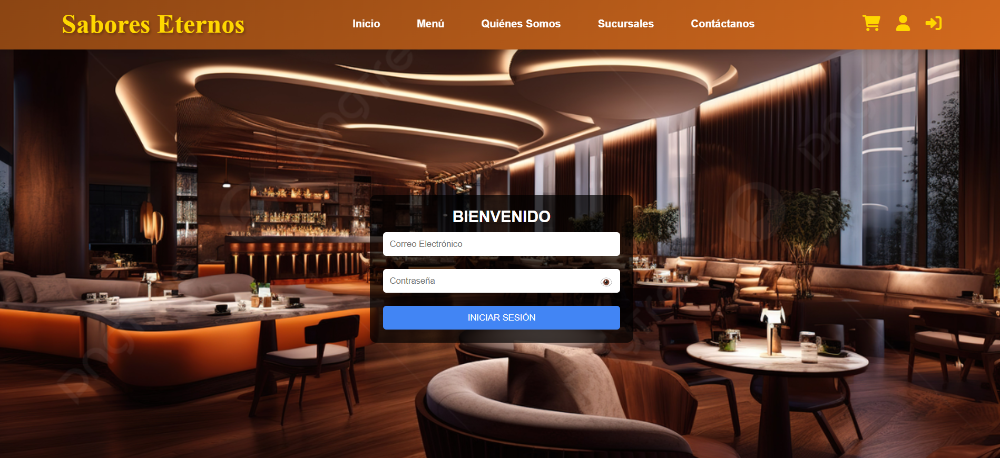<br><b>Login</b>
    </td>
    <td align="center">
      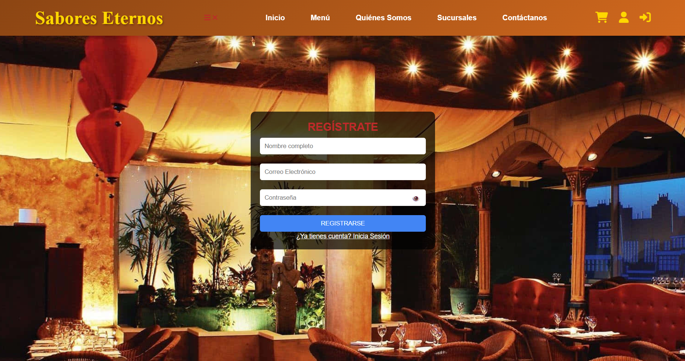<br><b>Registro</b>
    </td>
  </tr>
</table>

### 📞 Contacto
<table>
  <tr>
    <td align="center">
      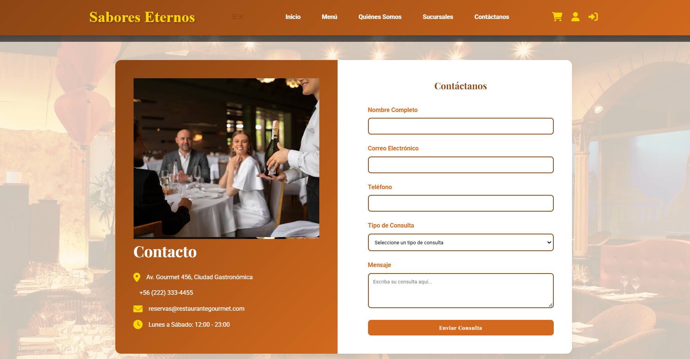<br><b>Contacto</b>
    </td>
  </tr>
</table>

### 🏢 Quiénes Somos
<table>
  <tr>
    <td align="center">
      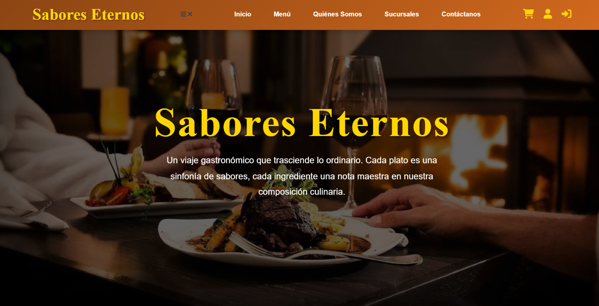<br><b>Quiénes Somos 1</b>
    </td>
    <td align="center">
      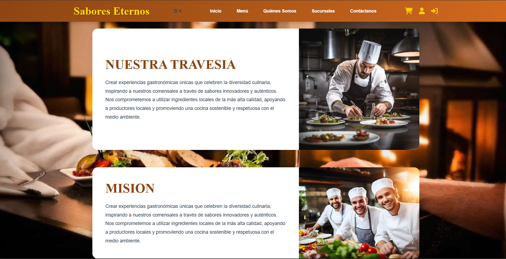<br><b>Quiénes Somos 2</b>
    </td>
    <td align="center">
      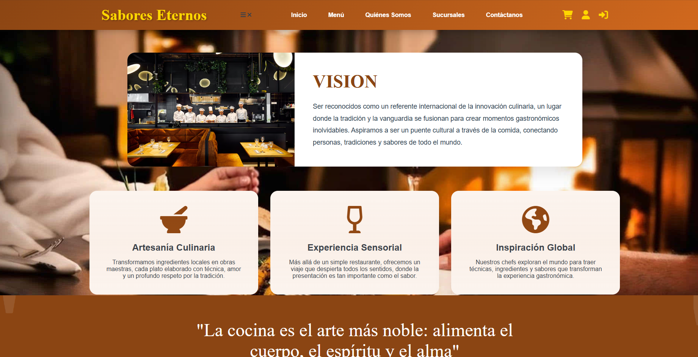<br><b>Quiénes Somos 3</b>
    </td>
  </tr>
</table>

### 📍 Ubicación
<table>
  <tr>
    <td align="center">
      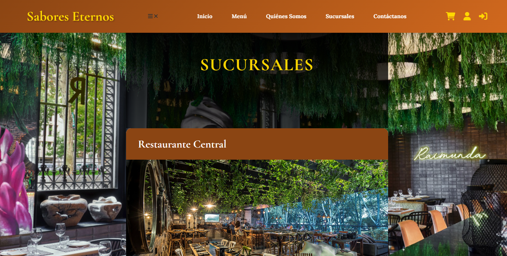<br><b>Ubicación 1</b>
    </td>
    <td align="center">
      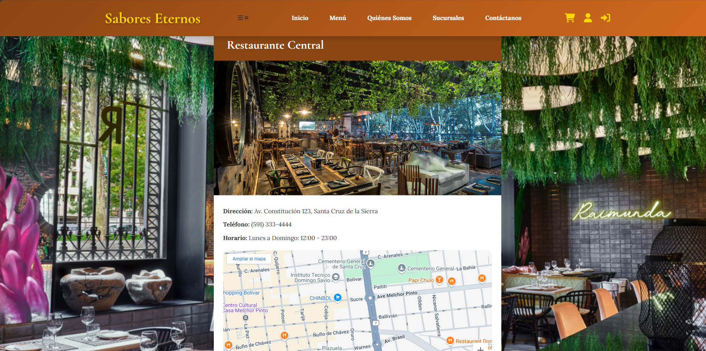<br><b>Ubicación 2</b>
    </td>
  </tr>
</table>

### 📱 Responsive
<table>
  <tr>
    <td align="center">
      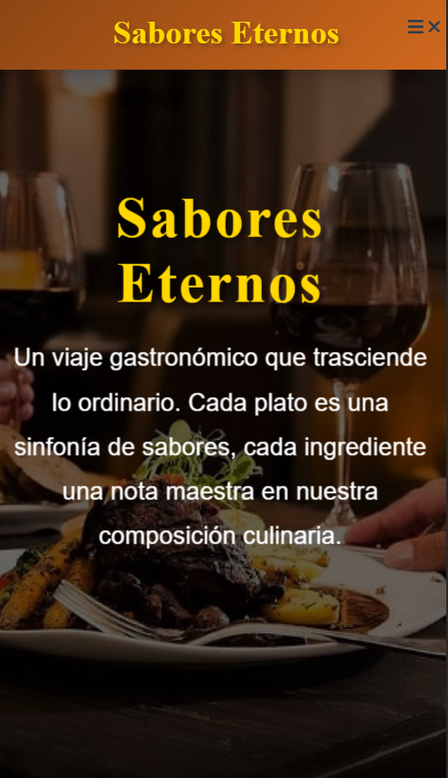<br><b>Vista Móvil</b>
    </td>
    <td align="center">
      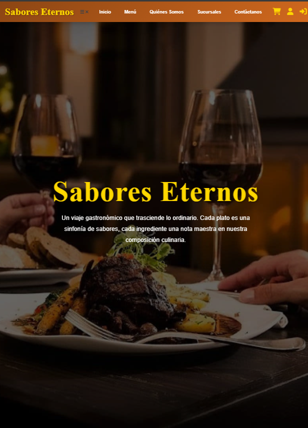<br><b>Vista Tablet</b>
    </td>
  </tr>
</table>

---

## 📁 Estructura del Proyecto

```
WEBRESTAURANTEDECOMIDA/
├── .htaccess
├── README.md
├── app/
│   └── controllers/
│       └── MenuController.php
├── public/
│   ├── index.html
│   ├── login.html / login.php
│   ├── registro.html / registro.php
│   ├── menu.html / menu.php
│   ├── carrito.php
│   ├── contacto.html / contacto.php
│   ├── procesar_contacto.php
│   ├── conexion.php
│   ├── quienesomos.html
│   ├── sucursal.html
│   ├── img/
│   │   └── screenshots/
│   └── css/
│       ├── contacto.css
│       ├── estilo.css
│       └── estilomenu.css
└── ...
```

---

## 🛠️ Tecnologías Utilizadas

- **Frontend:** HTML5, CSS3, JavaScript
- **Backend:** PHP (MVC ligero)
- **Servidor:** Apache (XAMPP/WAMP)
- **Base de datos:** MySQL (configurable en `conexion.php`)
- **Otros:** Archivos `.htaccess` para configuración de rutas

---

## ✅ Funcionalidades Principales

- Página de inicio y presentación del restaurante
- Registro y autenticación de usuarios
- Visualización dinámica del menú de productos
- Carrito de compras funcional
- Formulario de contacto con envío por PHP
- **Diseño responsive:** Adaptable a dispositivos móviles y tablets
- Arquitectura escalable y fácil de mantener

---

## 🚀 Instalación y Ejecución

1. **Clona el repositorio:**
   ```bash
   git clone https://github.com/tuusuario/webrestaurantedcomida.git
   ```

2. **Copia la carpeta al directorio de tu servidor local (XAMPP/WAMP):**
   ```
   C:/xampp/htdocs/WEBRESTAURANTEDECOMIDA/
   ```

3. **Configura la base de datos:**
   - Crea una base de datos MySQL.
   - Ajusta los parámetros de conexión en `public/conexion.php`.

4. **Inicia Apache y MySQL en XAMPP.**

5. **Accede desde tu navegador:**
   ```
   http://localhost/WEBRESTAURANTEDECOMIDA/public/index.html
   ```

---

## 📌 Notas

- El sistema puede ampliarse con panel de administración, gestión de pedidos y pasarelas de pago.
- Para mayor seguridad y escalabilidad, se recomienda migrar a frameworks como Laravel o Symfony.
- Las imágenes de ejemplo deben subirse a la carpeta `public/img/screenshots/` o directamente al repositorio para visualizarlas en este README.

---

## 📄 Licencia

Este proyecto está bajo la Licencia MIT. Consulta el archivo [LICENSE](LICENSE) para más detalles.

---

Desarrollado por **Alex Jhail Sanchez Rea**  
Estudiante de Ingeniería de Sistemas